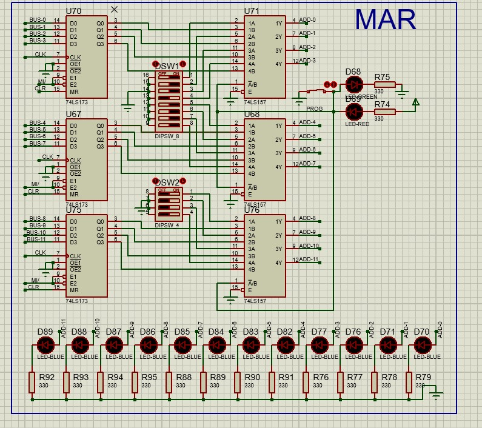
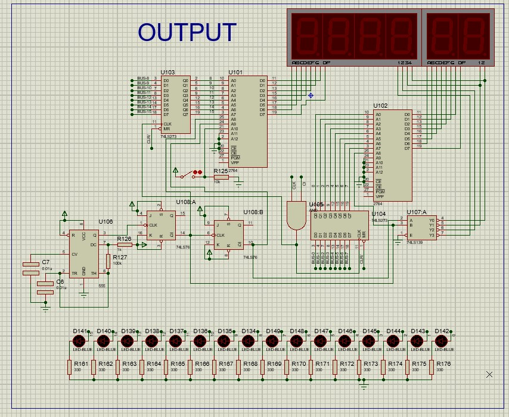

# 16-bit_microprocessor
Digital Project at university make a 16-bit microprocessor with Dr. Al Habrok
 
## Some Toutrial
Get some help from
[Ben Eater playlist: Building an 8-bit breadboard computer!](https://www.youtube.com/playlist?list=PLowKtXNTBypGqImE405J2565dvjafglHU)

## HINT
If you need any data sheets you will find them all in `data sheet` folder.

May be you need to check a `report.pdf` it have more detials than `readme`.

You need `proteus verision > 8` to open Simulation file

* `data sheet:` all IC's data sheets used.

* `ben eater:` schematic for Ben Eater's 8-bit microprocessor.

* `eeprom-programmer-master:` codeing for eeprom using arduino from Ben Eater.

* `PDF:` sortcut for each part as a pdf

* `screen:` screenshot for each part in proteus Simulation

# **Overview :**

I built a programmable 16-bit computer using only simple logic gates. The 16-bit computer is just able to add and subtract.

# **Clock module :**

The computer's clock is used to synchronize all operations. The clock we're building is based on the popular 555 timer IC.

Our clock is adjustable-speed (from less than 1Hz to a few hundred Hz). The clock can also be put into a manual mode where you push a button to advance each clock cycle. This will be a really useful feature for debugging the computer later on.

The timer 555ic has 3 mode to generate pulses :

| **1.Monostable**       |   **2.Astable**     |    **3.Bi–stable**     |
| ------ | ------ | ------ |

Using the 3 module we could make our clock for microprocessor like this is schematic :

**_Note:_** the label (HLT) coming from control logic  (CPU).

**_Note:_** we using logic gate to control in clock manual or by CPU or stop it or get one plus .

# Registers :

Most CPUs have a number of registers which store small amounts of data that the CPU is processing. In our simple, we'll build three 16-bit registers: A, B, and IR. The A and B registers are general-purpose registers. IR (the instruction register) works similarly, but we'll only use it for storing the current instruction that's being executed.

We used a 4-bits  D-type Register to store data and like a function table in datasheet of 74173-IC we control a data enable to store data in register and using Octal Bus Transceiver 74245-IC could control when appear the storing data on the bus.

**_Note:_** write data on register or reading from it is a (Active Low)pins , put reset pin is (Active High).

 

# Arithmetic logic unit (ALU):

The arithmetic logic unit (ALU) part of a CPU is usually capable of performing various arithmetic, bitwise, and comparison operations on binary numbers. In our simple, the ALU is just able to add and subtract. It's connected to the A and B registers and outputs either the sum of A+B or the difference of A-B.

Using 4-Bit Binary Adder with Fast Carry (74183-IC) and connect them together to get 16 bit (Carry output to Carry input), enter b-register in XOR gate(Exclusive-OR Gate) to control add or subtract (subtract done in two's complement). Using Octal Bus Transceiver 74245-IC control to appear data on bus.

We do a carry flag because if the output of adder is be more than 16-bit send high to CPU, and do a zero flag check if the output of ALU is zero -using NOR gate - then don't complete the programming because no data.  Then store data of flags in 2-bit register and connect the output of register to CPU.

 

# **Random access memory (RAM) module :**

The random access memory (RAM) stores the program the computer is executing as well as any data the program needs. Our computer uses 12-bit addresses which means it will only have 64 Kilo-bytes of RAM.

We use 6264-IC (8K x 8 Bit Fast Static RAM) we can read and write data from bus and save data in 12 address, we save address in Memory Address Register (MAR) we used 12-bit D-type register and using Quad 2-Line to 1-Line Data Selectors/Multiplexers (74175-IC) to select if we enter data and address manual from switches or from bus.

# Program counter

The program counter (PC) counts in binary to keep track of which instruction the computer is currently executing. Using 4-Bit Binary Counters (74161-IC) that is have enable and rest don't like 74190-IC that have enable and not have rest or 74192-IC that don't have EN, the EN use to stop counter, we used counter 12-bit to change the address of MAD. Using the 74245-IC to contral when appear the data on bus

# Output register

The output register is similar to any other register (like the A and B registers) except rather than displaying its contents in binary on 16 LEDs, it displays its contents in HEX on a 7-segment display (we make two way display and LEDs). Doing that requires some complex logic; luckily there’s an easier way: using EEPROM.

We use 2 EEPROM first one to appear first 8-bit on 2 digit in HEX and second to appear second 2 digit and sign of number, The switch change from unsigned to sign number,. Using Dual 2-to-4 line decoder/demultiplexer (74139-IC) to select which 7-seg is read data from EEPROM and using a timer 555lm and 2 j-k flip-flop (74107-IC), as a 2 bit counter, to change the select of Demultiplexer -In high frequency all 7-seg is appear different data in same time. Using 8-bit D-type (74273-IC) to save data from bus. 

# CPU control logic

The control logic is the heart of the CPU. It\’s what defines the opcodes the processor recognizes and what happens when it executes each instruction.

Using counter 74161-IC -to change the program to next step- and Dual 3-to-8 line decoder/demultiplexer (74138-IC) -to rest counter after 5 times- the Button to Reset all processor.

 

# Bringing it all together

 

# Ex:

##  Sum of two number :

First we put data manual in RAM by switches :

| Address | _Data_ |
| --- | --- |
| 0000 0000 0000 | 0001 0000 0000 1110 |
| 0000 0000 0001 | 0010 0000 0000 1111 |
| 0000 0000 0010 | 1110 0000 0000 0000 |
| 0000 0000 1110 | 0000 0000 0001 1100 (A) |
| 0000 0000 1111 | 0000 0000 0000 1110 (B) |

CPU will do that before every next steps so make them as a function and name it "CPU-SET":

**_"CPU-SET":_**

1. Counter output (CO) set to appear on bus, Memory address register input (MI) set  to read from the bus (counter data).
2. RAM Output (RO) set to appear the data saved  in the address -which set in step (1),
 the instruction register input (||) is set to read data from the bus -which in RAM- and save it , then counter enable (CE) is   set to increase the counter (+1).

**_||. LDA:_**

1. "CPU-SET"

2.  the instruction register Output (IO) is set and appear data in bus ,then Memory address register input (MI) set  to read from the bus (instruction register) -it's read only first 12-bits.

3. RAM Output (RO) set to appear the data saved  in the address -which set in last Step, the A register input (AI) is set to read data from the bus -which in RAM- and save it.

**_|||. ADD:_**

1. "CPU-SET".

2.  the instruction register Output (IO) is set and appear data in bus ,then Memory address register input (MI) set  to read from the bus (instruction register) -it's read only first 12-bits.

3. RAM Output (RO) set to appear the data saved  in the address -which set in last Step, the B register input (BI) is set to read data from the bus -which in RAM- and save it.

4. ALU Output (EO) is set to appear data on bus then , the A register input (AI) is set to read data from the bus -which in ALU- and save it.

**_Last OUT:_**

1. "CPU-SET".
2. the A register output (AO) is set and appear data in bus, then the output register input (OI) is set to save data from bus -the sum of two numbers- and appear it on display(7-seg) and 16 LEDs.

| _LDA_ | _ADD_ | _OUT_ |
| --- | --- | --- |
| CO || MI |
| RO  | II  |CE |
| IO MI | IO  MI | AO  OI |
| RO AI | RO BI | |
|   | EO  AI |   |
